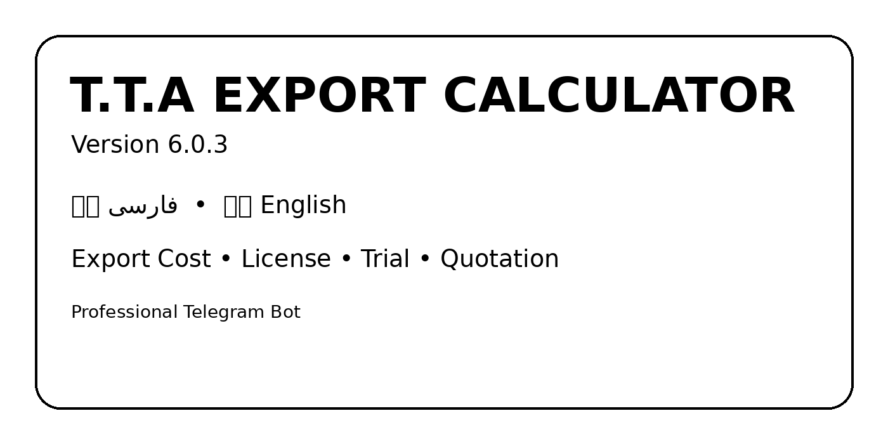

# 🇮🇷🇬🇧 T.T.A Export Calculator — v6.0.3



## 🌿 Professional Bilingual Telegram Export Calculator

**محاسبه حرفه‌ای قیمت تمام‌شده صادرات و صدور Customer Quotation**

A professional Telegram bot for calculating export landed cost and generating a customer-safe quotation PDF.

ربات حرفه‌ای تلگرام برای محاسبه قیمت تمام‌شده صادرات و صدور پیش‌فاکتور/Quotation امن برای مشتری.

## ✨ v6.0.3 Features | امکانات

- 🇮🇷 فارسی + 🇬🇧 English در تمام مراحل محاسبه
- 📦 Product / نوع و نام محصول — Example: `Dates / خرما`
- 📦 Packaging / نوع بسته‌بندی — Example: `Carton / کارتن`
- 🔢 Number of packages / تعداد بسته‌ها — Example: `3500`
- ⚖️ Gross weight per package / وزن ناخالص هر بسته — Example: `6.800 KG`
- ⚖️ Net weight per package / وزن خالص هر بسته — Example: `6.500 KG`
- 💰 Product purchase price / قیمت خرید محصول — Example: `133000 Toman/KG`
- 📦 Packaging & labor / بسته‌بندی و کارگر — Example: `3000 Toman/KG`
- 📈 Profit margin / حاشیه سود — Example: `6000 Toman/KG`
- 🚚 Inland freight / حمل زمینی تا بندرعباس
- 🛃 Customs clearance / هزینه ترخیص
- 🚢 Sea freight / حمل دریایی به USD
- 🇮🇷 Tehran payment + configurable tax / پرداخت تهران + مالیات قابل تنظیم
- 🇦🇪 UAE payment in AED / پرداخت امارات به AED
- 🧾 Switch Bill / Cross Stuffing
- 💱 USD exchange rate / نرخ دلار
- 📍 Destination / مقصد
- 👤 Customer / مشتری
- 📄 Customer-safe English quotation PDF
- 🎁 One-time 7-day trial / دوره آزمایشی ۷ روزه
- 🔐 Per-user license / لایسنس اختصاصی هر کاربر
- 👑 Admin & license management
- 🔑 Automatic license generation
- 🏢 Company profile and logo / پروفایل شرکت و لوگو
- 💾 SQLite database

## 🧮 Calculation Basis | مبنای محاسبه

**Gross Weight is the pricing basis.**

وزن ناخالص مبنای محاسبه قیمت است.

`Total Gross Weight = Number of Packages × Gross Weight per Package`

Customer price is automatically rounded **up** to the next `$0.05`.

مثال: `$1.245 → $1.25`

Net weight is retained as product information and can appear on the customer quotation.

## 🔐 Railway Variables | متغیرهای Railway

### Required | ضروری

```text
TELEGRAM_BOT_TOKEN
TTA_ADMIN_IDS
```

### Recommended | پیشنهادی

```text
TTA_DB_PATH=/data/tta_bot.db
TTA_TRIAL_DAYS=7
TTA_CREATOR_NAME=Amir Shabanian
TTA_CREATOR_PHONE=+98 939 625 5418
TTA_CREATOR_WHATSAPP=989396255418
TTA_CREATOR_TELEGRAM=<your_telegram_username>
```

**Never put Telegram tokens, API keys, passwords, or private secrets in GitHub.**

## 🚀 Railway Deployment | استقرار روی Railway

Start command:

```text
python bot.py
```

For production, attach a persistent Railway Volume and use:

```text
TTA_DB_PATH=/data/tta_bot.db
```

If Auto Deploy is enabled, Railway will deploy the latest commit from GitHub. Otherwise, use **Redeploy** from the Railway service.

## 🤖 BotFather Commands

```text
start - شروع کار با ربات
new - محاسبه جدید قیمت صادرات
profile - پروفایل شرکت
contact - ارتباط با سازنده
help - راهنمای استفاده از ربات
license - مدیریت لایسنس
```

## 🏢 T.T.A

**Tamana Tejarat Armaghan (T.T.A)**

Professional export/import, customs and international trade services.

**تمنا تجارت ارمغان (T.T.A)**

خدمات صادرات، واردات، ثبت سفارش، امور گمرکی و تجارت بین‌الملل.

---

### Version 6.0.3
Professional bilingual export-cost calculation and customer quotation system.
